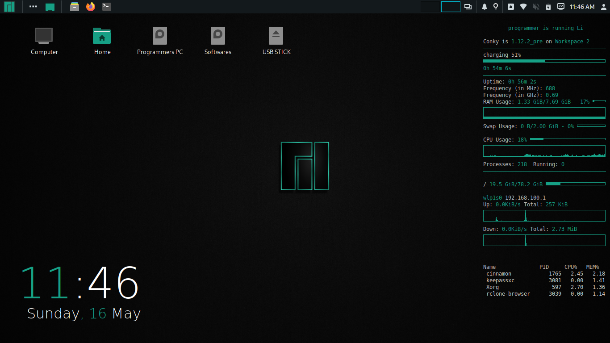
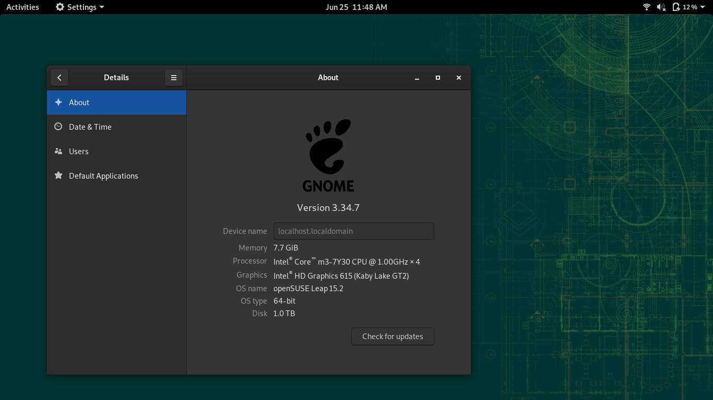
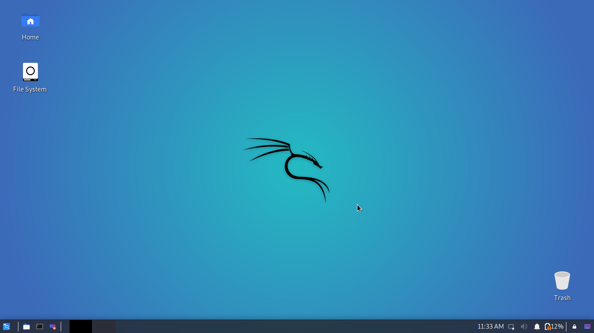
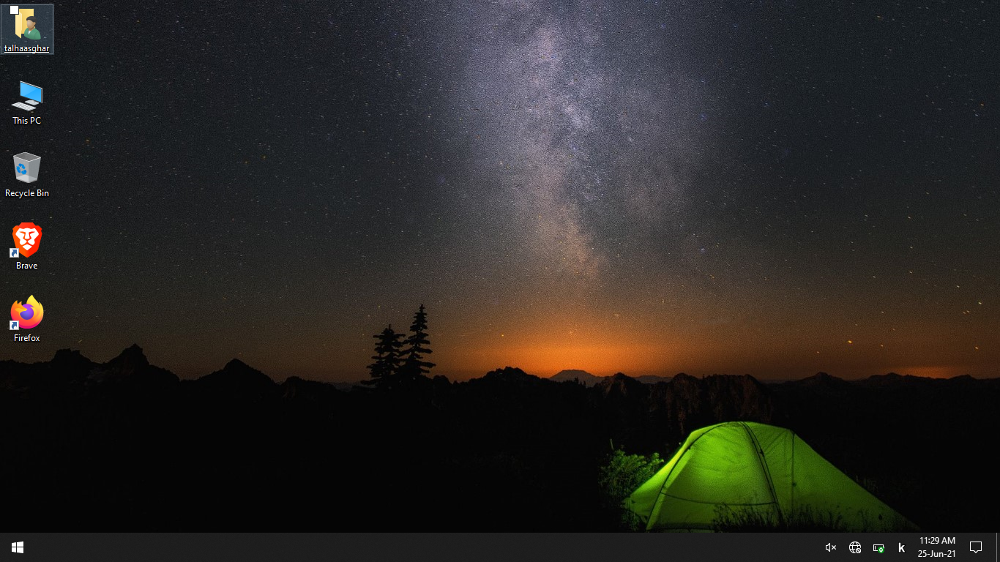
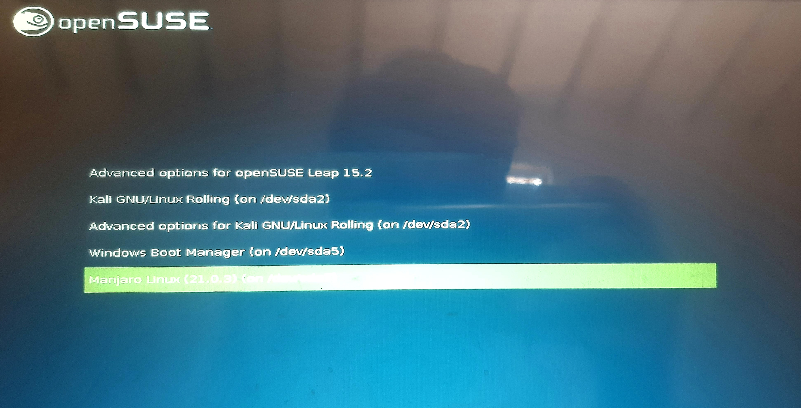

## Hi there 👋 I'm [Talha Asghar](https://talhaasghar.me) 😀

 
Linux 🐧 is better than windoze and Manjaro is my favourite Linux Distro.
 

## Distros I have in my PC (Dual Boot)
|  | |
|:---:|:---:|
| Manjaro Xfce (for daily Usage) | AntiX Linux Icewm (for Android Development) |
## Distros I have in my Laptop (Quad Boot)
|| | | |  |
|:---:|:---:|:---:|:---:|:---:|
| Manjaro Cinnamon (for Daily Usage & Programming) |OpenSuse Leap (i use it occassionaly for multimedia) |Kali Linux Xfce (for occassional Pentesting) |Windoze (because we don't have Visual Studio in Linux) | Boot Menu
