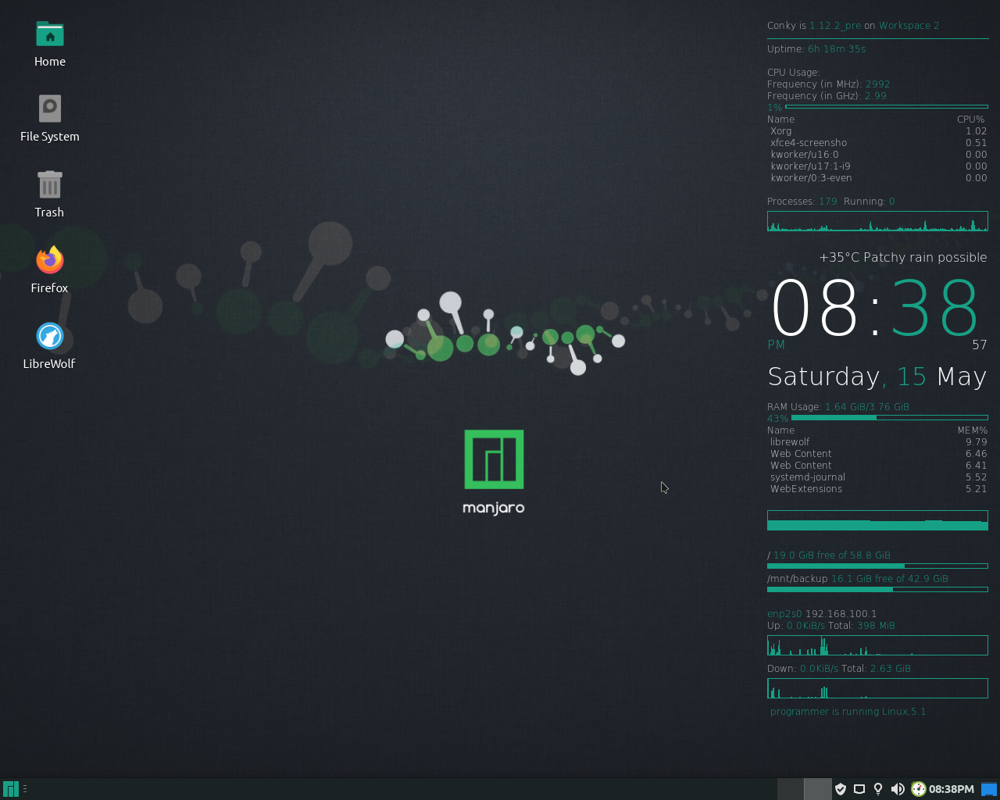
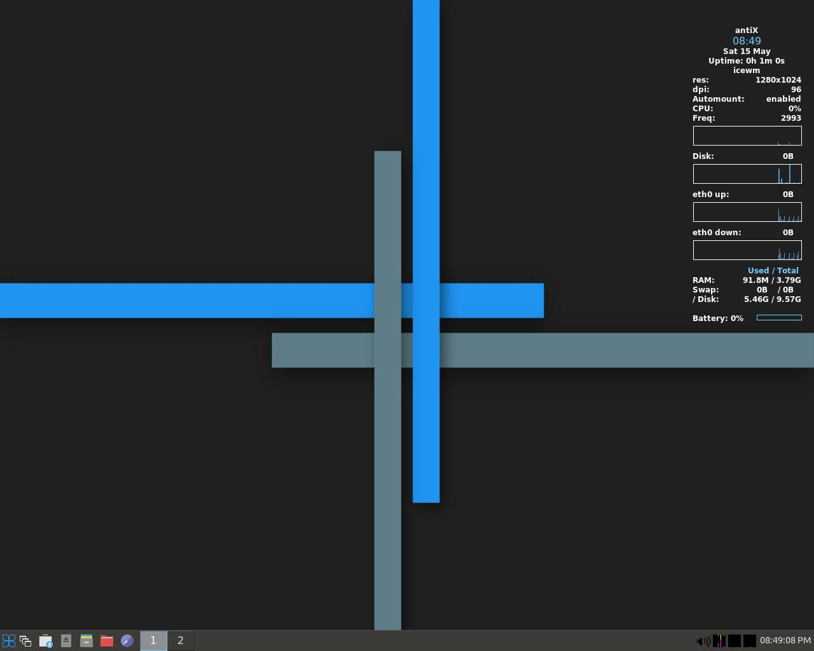

Yet another Windoze user who has switched to Linux. Now, I use [Manjaro](https://manjaro.org/) and [antiX Linux](https://antixlinux.com/) across different devices. I am also following a learning path for FULL STACK DEVELOPER.   
## Current Setup on my PC (Dual Boot)
|  | |
|:---:|:---:|
| Manjaro Xfce (for daily Usage) | AntiX Linux Icewm (for Android Development) |
## Current Setup on my Laptop
||

|:---:|
